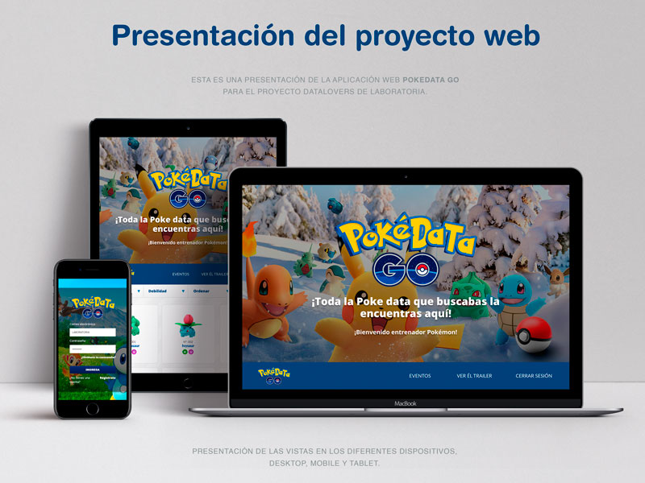
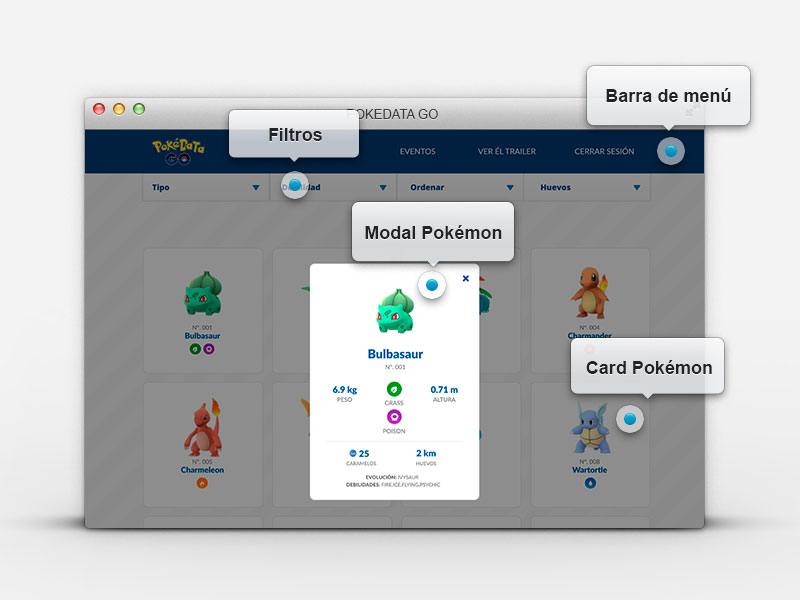
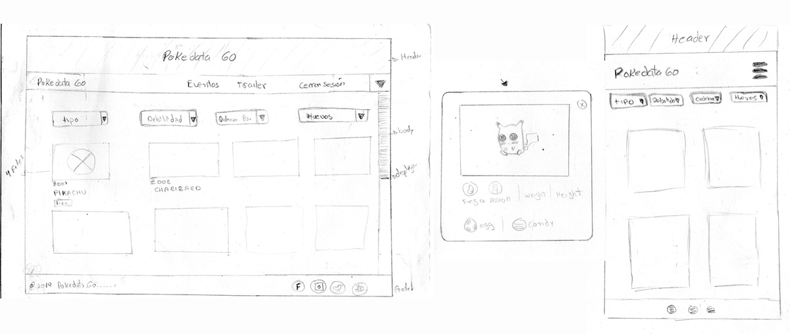
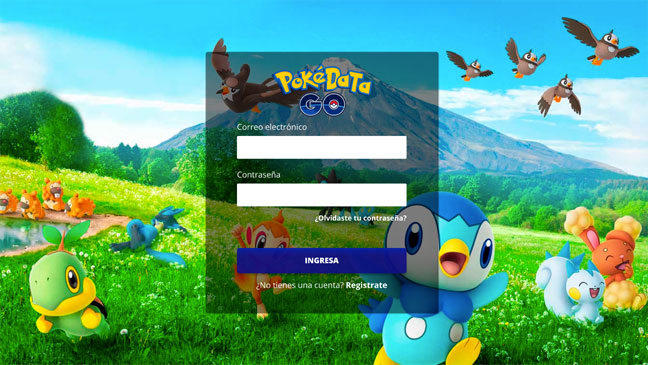
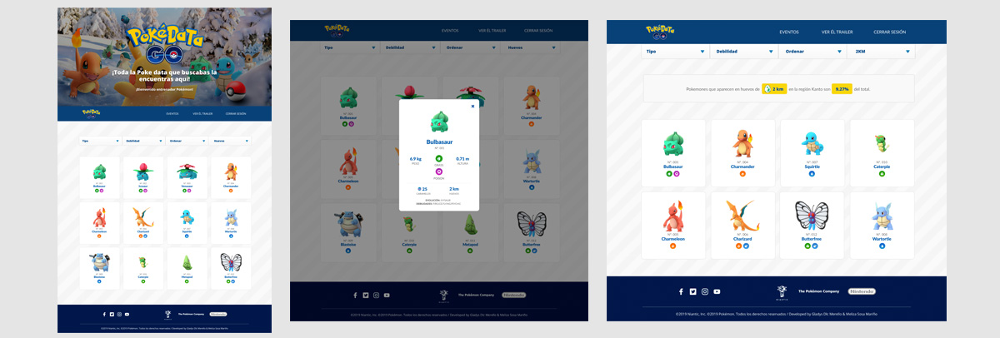
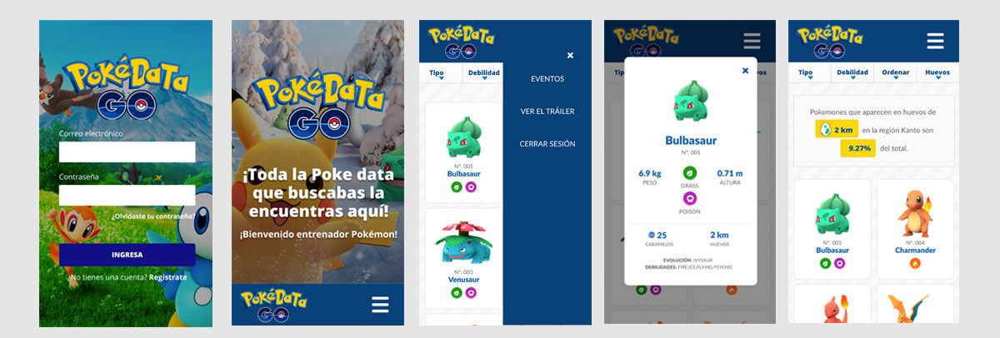
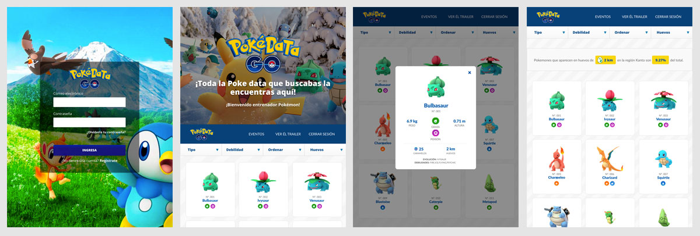
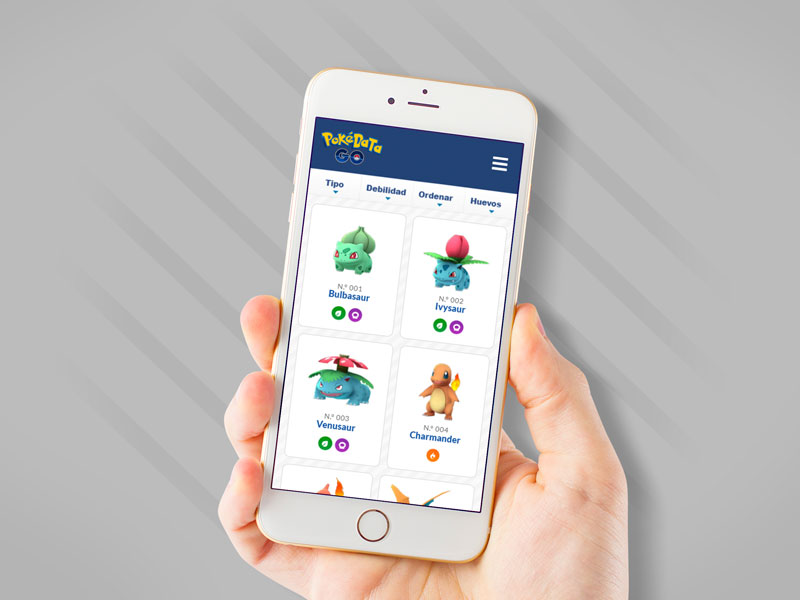

# PokeData Go

## Índice

- [Índice](#índice)
- [Resumen del proyecto](#resumen-del-proyecto)
- [Imagen del proyecto](#imagen-del-proyecto)
- [Investigación UX](#investigacion-ux)
  - [Usuario](#usuario)
    - [Historias de Usuario](#historias-de-usuario)
  - [Objetivos del proyecto](#objetivos-del-proyecto)
  - [Soluciona los problemas / necesidades del usuario](#soluciona-los-problemas-necesidades-del-usuario)
  - [Prototipo baja fidelidad](#prototipo-baja-fidelidad)
  - [Feedback](#feedback)
  - [Prototipo alta fidelidad](#prototipo-en-figma)

***

## Resumen del proyecto

Se realizará una aplicación web que permita consultar el listado completo de los Pokémons de la región Kanto. La consulta incluirá datos de atributos, aparición en huevos, entre otros. También, se podrá aplicar el filtrado por tipo de Pokémon y realizar el ordenamiento alfabéticamente o por frecuencia de aparición.
- El usuario accederá a la aplicación utilizando las siguientes credenciales. Usuario: LABORATORIA / Contraseña: LABORATORIA

## Imagen del proyecto

## Investigación UX

### Usuario

El usuario objetivo son los jugadores de la aplicación móvil Pokémon Go, disponible para Android y iOS.

- Para la realización del proyecto se recurrio al testeo con tres usuarios.
- Dos de ellos eran jugadores frencuentes de la aplicación PokemonGo y el ultimo era un usuario novato.
- Se pregunto a todos ellos cual es la información más importante que ellos necesitan encontrar en el aplicativo.
- En base al primer testeo se les presento el prototipo de baja fidelidad, donde nos señalaron los elementos que identificaron. De acuerdo a estos comentarios, se decidio realizar cambios y mejoras para realizar el primer demo.
- En la segunda revisión del demo los usuarios realizaron algunas acciones e identificaron la información que ellos buscaban o creian mas relevante.
- También se obtuvo feeback del squad y las coach.

#### Historias de Usuario

#### SPRINT 1
>Historia 1: Como usuaria quiero poder loguearme para acceder al sitio web.
#### Criterio de aceptación.
- [x] Se deben visualizar input para ingresar el usuario y contraseña.
- [x] Al ingresar el usuario y contraseña correctamente se debe mostrar la siguiente vista del home.
- [x] Al ingresar el usuario y contraseña incorrectamente, debe salir un mensaje de bloqueo al tercer intento y no permitir continuar a la siguiente vista.
- [x] Los inputs y submit deben bloquearse.

#### SPRINT 2
>Historia 2: Quiero poder ver a todos los pokemones al ingresar a la página para saber cuántos tengo y cuántos me faltan atrapar.
#### Criterio de aceptación.
- [x] Por fila se debe visualizar 4 pokemones.
- [x] En la pantalla principal solo debe de visualizar 4 columnas de pokemones.
- [x] Por pokemón se debe de visualizar el nombre y numero respectivo.
- [x] La ventana de los pokemones debe de tener los filtros de tipo, debilidad, ordenar por tipos y un buscador.

>Historia 3: Como usuaria quiero poder elegir un pokemon para ver sus características más relevantes.

#### Criterio de aceptación
- [x] Al seleccionar a un pokemon se debe mostrar un popup.
- [x] En la ventana de emergente se debe de visualizar las características relevantes.
- [x] Las características se tiene que visualizar debajo de la imagen.
- [x] La ventana emergente tiene que tener la opcion de cerrar.

>Historia 4: Quiero poder obtener el filtro de los pokemones de (A-Z, Z-A) para tener un orden más fácil.

#### Criterio de aceptación
- [x] Al filtrar la opción de ordenar por A-Z se debe mostrar los pokemones en ese orden.
- [x] Al filtrar la opción de ordenar por Z-A se debe mostrar los pokemones en ese orden.
- [x] Luego de realizar el filtro al hacer click en el pokemon se debe mostrar las características.

#### SPRINT 3

>Historia 5: Quiero poder  filtrar por tiempo de aparición de manera ascendente  o descendente a los pokemones para poder ubicarlos fácilmente y saber cuáles son los más difíciles de atrapar.

#### Criterio de aceptación
- [x] Que el usuario tenga la opción de seleccionar para ordenar por tiempo de aparición de forma ascendente los pokemones.
- [x] Que el usuario tenga la opción de seleccionar para ordenar por tiempo de aparición de forma descendente los pokemones.
- [x] Que al seleccionar un tipo de pokemón se visualice de manera descendente.
- [x] Que el usuario al seleccionar ascendente se visualice los pokemones de menor a mayo tiempo de aparición.
- [x] Que el usuario al seleccionar descendente se visualice los pokemones de mayor a menor tiempo de aparición.
- [x] Que el usuario luego de seleccionar una de las opciones al hacer clic en el pokemon nos muestre una ventana con los datos correspondientes.

>Historia 6: Como Usuario quiero poder  filtrar por tipo los pokemones para saber cuantos tengo.

#### Criterio de aceptación
- [x] El usuario tenga la opción del filtro.
- [x] El usuario al seleccionar el filtro por tipo se despliegue toda los tipos de pokemón.
- [x] El usuario pueda seleccionar cualquier tipo de pokemon.
- [x] El usuario al seleccionar un tipo se visualice los pokemones correspondientes.
- [x] El usuario pueda visualizar el total de los pokemones segun el filtro.
- [x] Que el usuario luego de realizar el filtro por tipo pueda filtrar todo los pokemones.
- [x] Que la lista de cada pokemon al hacer clic se pueda ver las características relevantes.

> Historia 7: Quiero poder  filtrar por debilidades de los pokemones.

#### Criterio de aceptación
- [x] Que los pokemones se visualice por tipo de debilidad.
- [x] Que nos muestre los pokemones que son débiles con otros de diferente tipo.

> Historia 8: Como usuario quiero obtener el porcentaje de los pokemones que aparecen en los diferentes tipos de huevo para saber que huevos eclosionar.

#### Criterio de aceptación
- [x] El usuario tenga la opción la opción del filtro por huevo.
- [x] El usuario al seleccionar el filtro por tipo de huevo según km se desplegue toda las opciones.
- [x] El usuario pueda seleccionar cualquier tipo de km de pokemón.
- [x] El usuario al seleccionar cualquier km de huevo se visualice los pokemones correspondientes.
- [x] El usuario pueda visualizar el % según el km seleccionado.
- [x] Que la lista de cada pokemon al hacer clic se pueda ver las características relevantes.

### Objetivos del proyecto

El objetivo es desarrollar una aplicación web que sea utilizada por los jugadores del videojuego Pokemon Go, para consultar la información relevante para ellos. 

### Soluciona los problemas / necesidades del usuario

El usuario necesita consultar la lista completa de los Pokémons para saber cuántos tiene y cuántos le faltan atrapar. También, necesita conocer todos los atributos de estos Pokémons.

### Prototipo baja fidelidad

### Feedback

En el feedback realizado se indicó:

- En el primer demo realizado con el squad, nos indicaron que colocaramos mas imagenes relacionadas al tema, como fondos e ilustraciones.

- En el testeo con los usuarios, se propuso que en el formato para dispositivo mobile, al visualizar los pokemons se mostraran en dos columnas.

- Los usuarios también propusieron que el menÚ y los filtros se deberian mostrar siempre para facilitar las busqueda, para ello se creo un menú pegajoso.

### Prototipo alta fidelidad
[Prototipo en Figma](https://www.figma.com/file/2uV1blI0ANV3O6S4R6GDgT/DataLovers-PokeData-Go?node-id=1%3A2)

#### Desktop Login

#### Desktop Home

Screen Home / Screen Modal / Screen Porcentaje de huevos

#### Dispositivo Mobile

Screen Login / Screen Home / Screen Menu Open / Screen Modal / Screen Porcentaje de huevos

#### Dispositivo Tablet

Screen Login / Screen Home / Screen Modal / Screen Porcentaje de huevos

## Presentación mobile Pokedata Go

